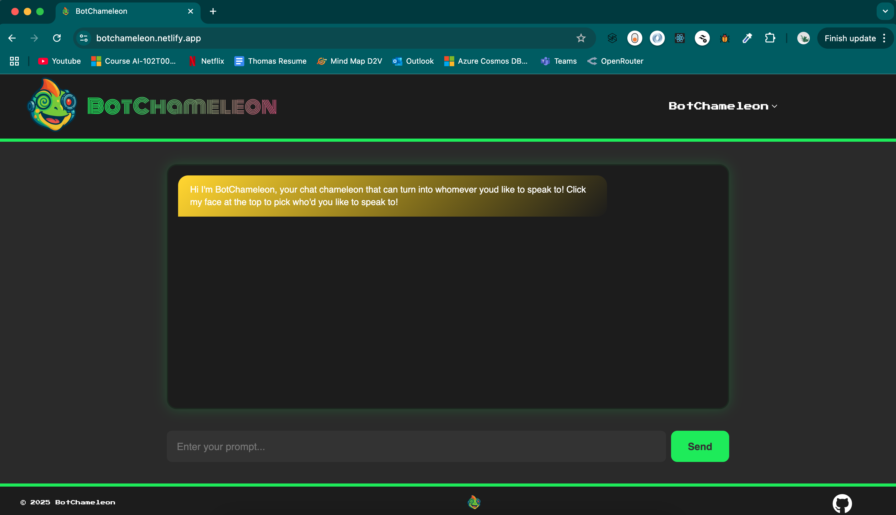
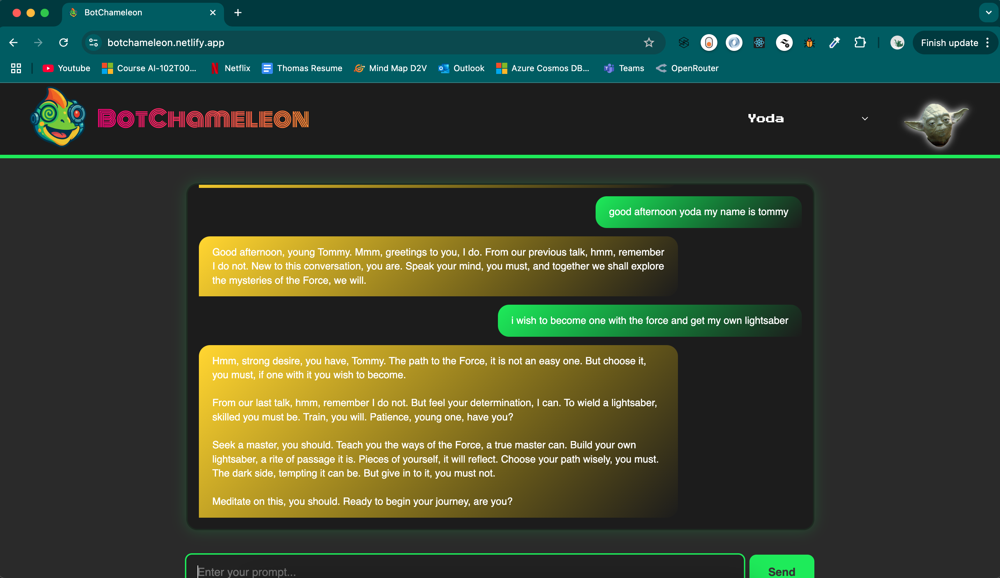
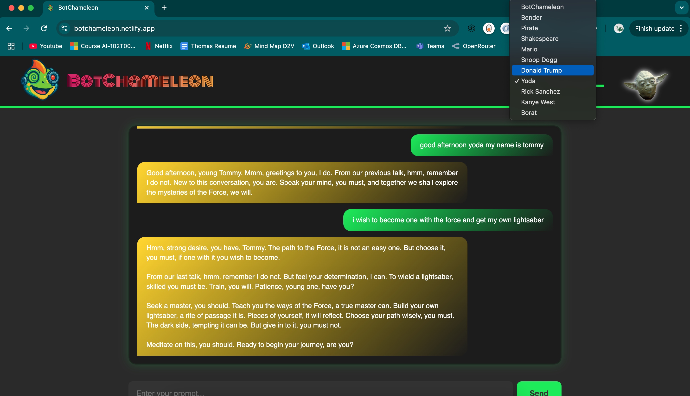

# BotChameleon

**Your AI Chat Companion That Transforms Into Anyone**

BotChameleon is an interactive AI chatbot application that allows users to switch between different character personalities while maintaining conversation context. Chat with Yoda, get roasted by Bender, receive wisdom from Shakespeare, or get help from any of the available characters - all while keeping the conversation flowing naturally!

## ✨ Features

- **Multiple AI Personalities**: Switch between 10+ unique characters including:
  - **BotChameleon** - The helpful default assistant
  - **Bender** - Sarcastic robot from Futurama
  - **Pirate** - Swashbuckling sea dog (Jack Sparrow style)
  - **Shakespeare** - The eloquent Bard himself
  - **Mario** - Everyone's favorite plumber
  - **Snoop Dogg** - Smooth-talking rap legend
  - **Donald Trump** - The tremendous former president
  - **Yoda** - Wise Jedi Master
  - **Rick Sanchez** - Nihilistic scientist from Rick & Morty
  - **Kanye West** - Controversial rap genius
  - **Borat** - Kazakh reporter
  - **Uncle Ruckus** - Famed Controversial Boondocks Character
  - **Kevin O'Leary** - Most Dangerous Shark in The Tank
  - **Jerry Seinfeld** - Comedian From the Famous Show
  - **Ru Paul** - The Baddest Queen
  - **More Chaaracters To Come!**

- **Persistent Context**: Characters remember previous conversations even when you switch between them
- **Real-time Chat**: Instant responses with auto-scrolling chat interface
- **Session Management**: Unique session tracking for each conversation
- **Responsive Design**: Works seamlessly on desktop and mobile devices
- **Character Switching**: Seamlessly switch personalities mid-conversation

## 🚀 Live Demo

[Visit the live application here!](https://botchameleon.netlify.app/)

### The home page

### Conversations

### Charaters

## 🛠️ Technology Stack

### Frontend
- **React 18** - Modern React with hooks
- **CSS3** - Custom styling for responsive design
- **Vite** - Fast build tool and development server

### Backend
- **Python Flask** - Lightweight web framework
- **OpenRouter API** - AI model integration (Mistral AI)
- **Flask-CORS** - Cross-origin resource sharing
- **python-dotenv** - Environment variable management

### Deployment
- **Netlify** - Front End Deployment
- **Render** - Cloud application platform
- **Git** - Version control

## 🎯 How It Works

1. **Session Management**: Each user gets a unique session ID for tracking conversations
2. **Context Preservation**: All messages are stored in context history that persists across character switches
3. **Character Switching**: When switching characters, the AI receives system instructions about the change while maintaining conversation memory
4. **Smart Context Limiting**: Conversations are limited to the last 30 exchanges to prevent token limit issue

## 🚨 Content Warning 18+

This application contains character impersonations that may include:
- Strong language and adult humor
- Satirical content
- Controversial opinions (for entertainment purposes)
- Coarse Language
- Swearing
- Sexual Content

All content is generated by AI for entertainment purposes only and does not reflect the views of the developers.

## 📄 License

This project is licensed under the MIT License - see the LICENSE file for details.

## 🙏 Acknowledgments

- OpenRouter for AI API services
- Mistral AI for the language model
- The React and Flask communities
- All the fictional characters that inspired our personalities

---

**Made with ❤️ by Thomas Azran**